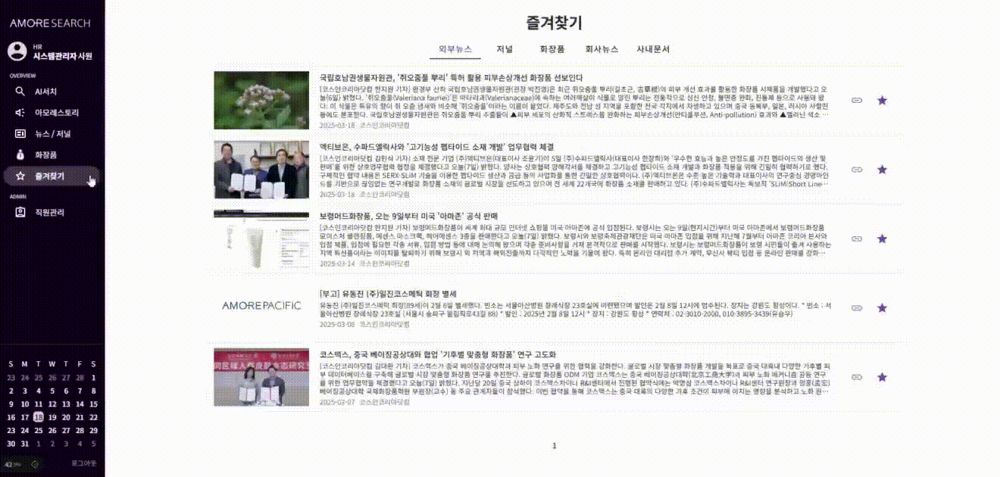
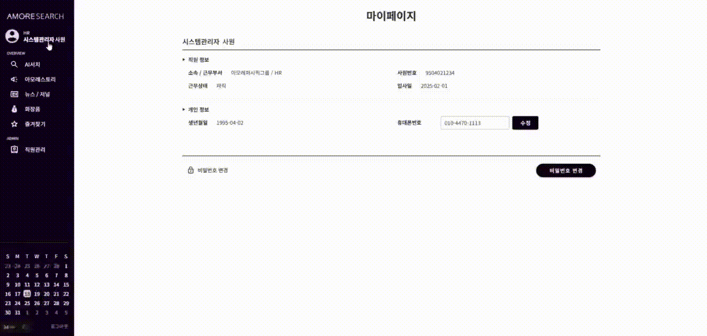
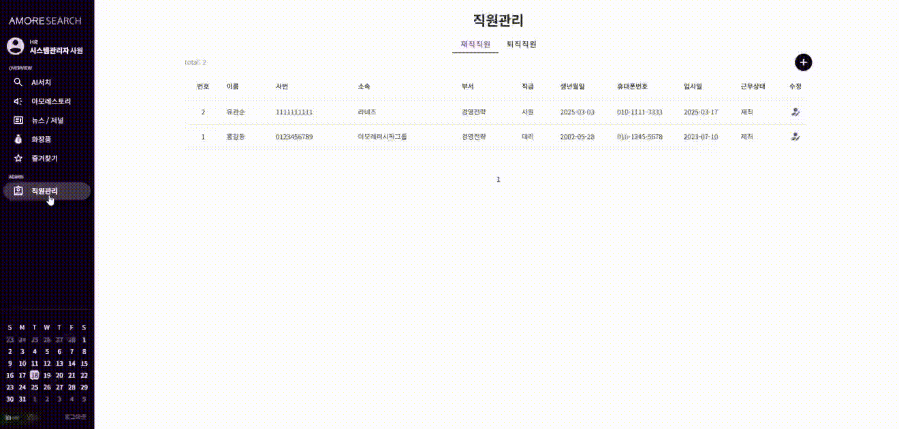

# 💄AmoreSearch

AmoreSearch는 sLLM을 기반으로 아모레퍼시픽에서 사용할 수 있는 <b>사내 검색 시스템</b>으로 핵심 목표는 <b>sLLM</b>을 개발하고 <b>파인튜닝</b>하여 최적화된 검색 경험을 제공하는 것입니다.

<!-- [🔗 AmoreSearch 웹서비스](http://15.165.170.3) &nbsp;&nbsp;&nbsp;&nbsp;&nbsp;&nbsp; [📽️ 시연 영상]() -->

<br/>

## 1. 프로젝트 개요
### 📅 작업 기간
2025.01.21 ~ 2025.03.20 

<br/>

### 🛠️ 기술스텍
- **프론트엔드**: `Nuxt.js` → NuxtImg, Vuetify ···
- **백엔드**: `FastAPI` → Langchain, Chromadb, PyMySQL, Pydantic, PyJWT ···
- **데이터베이스**: `MariaDB`, `ChromaDB`
- **LLM, Embedding 모델**: `RunPod`  → llm - Qwen2.5-72B-Instruct / 임베딩 - multilingual-e5-large
- **서버 인프라**: `AWS EC2`, `S3`

<br/>

### 🗂️ 디렉토리 구조
<details> <summary>자세히 보기</summary>

```bash
📦 프로젝트 루트
├── 📂 frontend        # 프론트엔드 (Nuxt.js)
│   ├── 📂 assets      # 정적 파일 (CSS, 이미지 등)
│   ├── 📂 components  # Vue 컴포넌트 모음
│   │   ├── 📂 Dialog
│   │   ├── 📂 ListItem
│   │   ├── Lnb.vue
│   │   ├── Paging.vue
│   │   ├── RnbProduct.vue
│   │   ├── SearchInput.vue
│   ├── 📂 composables  # 재사용 가능한 함수 모음
│   │   ├── useApi.ts
│   │   ├── useState.ts
│   ├── 📂 layouts      # 레이아웃 컴포넌트
│   │   ├── default.vue
│   ├── 📂 middleware   # 미들웨어
│   │   ├── auth.ts
│   │   ├── valid_member.global.ts
│   ├── 📂 pages        # 페이지 컴포넌트
│   │   ├── 📂 admin
│   │   │   ├── ai-search.vue
│   │   │   ├── amorestory.vue
│   │   │   ├── dashboard.vue
│   │   │   ├── favorites.vue
│   │   │   ├── index.vue
│   │   │   ├── mypage.vue
│   │   │   ├── news-journal.vue
│   │   │   ├── products.vue
│   ├── 📂 plugins      # 플러그인 모음
│   │   ├── api.ts
│   │   ├── vue-the-mask.js
│   │   ├── vuetify.ts
│   ├── 📂 public       # 공개 정적 파일 (이미지, 폰트 등)
│   │   ├── 📂 img
│   │   │   ├── 📂 icon
│   │   │   ├── 📂 logo
│   │   │   │   ├── logo_symbol_w.svg
│   │   │   │   ├── logo_w.svg
│   │   │   │   ├── logo.svg
│   │   │   ├── product1.webp
│   │   │   ├── product2.webp
│   │   ├── favicon.ico
│   │   ├── robots.txt
│   ├── 📂 utils        # 유틸리티 함수 모음
│   │   ├── common.util.ts
│   │   ├── types.ts
│   │   ├── variable.util.ts
│   ├── app.vue
│   ├── nuxt.config.ts
│   ├── package.json
│
├── 📂 backend             # 백엔드 (FastAPI)
│   ├── 📂 app
│   │   ├── 📂 core          # 핵심 로직 (LLM, 벡터스토어 관리, 보안관리 등)
│   │   │   ├── llm.py
│   │   │   ├── security.py
│   │   │   ├── vectorstore.ipynb
│   │   │   ├── 📂 multilingual-e5-large
│   │   ├── 📂 db
│   │   │   ├── connection.py
│   │   │   ├── session.py
│   │   ├── 📂 routers
│   │   │   ├── admin.py
│   │   │   ├── amorepacific.py
│   │   │   ├── auth.py
│   │   │   ├── member.py
│   │   │   ├── post.py
│   │   │   ├── product.py
│   │   │   ├── search.py
│   │   ├── 📂 schemas
│   │   │   ├── main.py
│   │   │   ├── model.py
│   ├── Dockerfile
│   ├── requirements.txt
```
</details> 

<br/>

### 🔃 실행 방법
- **FE 실행**
```bash
cd frontend
pnpm install
pnpm run dev
```
- **BE 실행**
```bash
cd backend/app
uvicorn main:app --reload
```
<br/>

## 2. 프로젝트 소개
### 🚀 주요 기능
- AI 검색
- 회사소식, 사내문서 조회 및 검색
- 화장품 조회 및 검색
- 직원관리
- 업계 최신뉴스 및 저널 모아보기 

<br/>

### 🏰️ 시스템 아키텍처 구조 


- CI/CD: Github Actions
- EC2 인스턴스 1: 프론트엔드(Nuxt.js), 백엔드(FastAPI), MariaDB 배포
- EC2 인스턴스 2: 벡터 스토어(ChromaDB) 배포 및 관리
- LLM, Embedding 모델: RunPod에서 실행하여 검색 성능 최적화
- AWS S3: 데이터 저장 및 관리

<br/>

### 📱 UI
<p></p>
<p></p>
<p></p>
<p></p>

<br/>

### 💾 데이터베이스
- RDB - MariaDB
- Vector Store - ChromaDB
- cloud - S3 

<br/>

### 🪛  sLLM 모델링 과정에서 했던 실험
- **Embedding 모델 성능 평가** 
    - bge-m3
    - multilingual-e5-large (✅)
- **HyQE**
- **HyQE 질문을 위한 sLLM 모델 미세조정**

### 📌 이번 프로젝트를 마치며 새롭게 알게된 부분
- CI/CD
- Vuetify3
- Fast Api
- Fine Tuning
- Tool Calling 
https://python.langchain.com/docs/concepts/tool_calling/

<br/>

LangChain을 활용한 Tool Calling 으로 Agentic 하게 구현하고자 함
- query에 따른 각 collection 선택 후 retrieve
- Cosin Similarity를 통한 HyQE 질문을 활용한 답변 ReRank
- ReRank를 통해 관련된 질문 4개 추출
